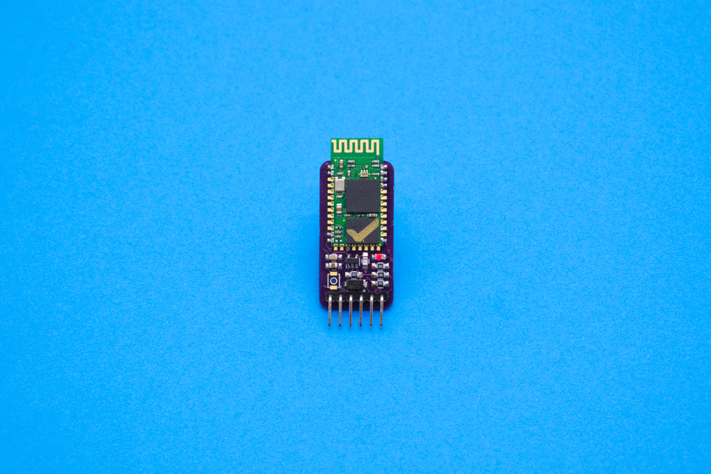

# Elemental Kit - Bluetooth HC-05



El módulo bluetooth incorpora el famoso módulo HC-05. Este módulo nos permite crear un túnel serie sin cables. En otras palabras, nos permite conectarnos a otro dispositivo mediante comunicación serie de manera inalámbrica. Podrás conectarte a tu móvil, a una tablet, un pc, incluso puedes conectar dos placas Grape para que se manden información entre ellas. 

El módulo soporta tanto 3.3V como 5V por lo que no necesitas ningun conversor de nivel para hacer tus proyectos. 


## Características

* Modulo HC05 Maestro-Esclavo
* Bluetooth 2.0
* Chipset CSR BC417143
* Tensión de entrada de 3.3 a 5V
* Banda 2.4GHz ~ 2.48GHz
* Contraseña por defecto: 1234

##Primeros pasos
--------

Las funcionalidades de los pines son las siguientes:

| Pin   |  Función |
| ----- | --------|
| EN    | Enciende o apaga el LDO  |    
| VCC   | VCC |    
| GND   | GND    |     
| TX    | Transmisión de datos    |   
| RX    | Recepción de datos   |   
| STATE | Estado del módulo  |     
 
El pin EN de ENABLE, sirve para activar o desactivar el módulo. Si lo dejamos al aire o lo conectamos a LOW, el módulo permanecera activo, mientras que si conectamos a HIGH, apagaremos el módulo. Esto es realmente útil a la hora de apagar o encender el módulo con nuestra [Grape](https://www.frizzy.es/grape/) o [Arduino](www.arduino.cc), ya que, conectándolo a un pin digital podremos activar o desactivar el bluetooth.

El pin STATE lo podemos utilizar para recibir feedback de nuestro módulo. Podemos conectar este pin a un pin de nuestra [Grape](https://www.frizzy.es/grape/) y leerlo para saber si el módulo ha establecido comunicación o no. Si el módulo esta conectado, por ejemplo, a tu móvil, este pin nos devolverá un HIGH y si no lo está, un LOW. ¿Útil no? Desde nuestro microcontrolador podremos saber si esta conectado o no!


###Grape

La conexión del módulo bluetooth a la grape es muy sencilla, simplemente tienes que alimentar el modulo con 5V con los respectivos pines GND-VCC y conectar el TX de la placa al RX del módulo y el RX de la placa al TX del módulo. Al establecer esta conexión, si el módulo esta conectado, por ejemplo con nuestro móvil, nos imposibilita subir un nuevo sketch. Para solucionar esto, crearemos un puerto serie virtual con la ayuda de la librería "SoftwareSerial.h" incluída por defecto en nuestro Arduino IDE.


```arduino
#include <SoftwareSerial.h>  //Incluimos la libreria software serial para crear nuestro puerto virtual

#define RXPin 9  //Definimos el pin RX en el 9, el cual conectamos al TX del modulo
#define TXPin 10 //Definimos el pin TX en el 10, el cual conectamos al RX del modulo

SoftwareSerial nuevo_serial(RXPin, TXPin);
 
char dato = 0;
 
void setup()
{

   nuevo_serial.begin(9600);
   pinMode(13,OUTPUT);

}
 
void loop()
{

  while(nuevo_serial.available()>0) {
    dato = nuevo_serial.read();
    if ( dato == '1'){
        digitalWrite(13,HIGH);
    }
    else{
        digitalWrite(13, LOW);
    }
  } 
}
```

##Recursos
-------
-   [Datasheet](https://raw.githubusercontent.com/FrizzyElectronics/ModuloBluetooth/blob/master/datasheet/bluetooth-hc05.pdf "File:bluetooth-hc05.pdf")
-   [Archivos PCB en KiCAD](https://github.com/FrizzyElectronics/ModuloBluetooth)
-   [Esquema en PDF](https://raw.githubusercontent.com/FrizzyElectronics/ModuloBluetooth/master/pdf/Modulo_bluetooth.pdf "File:Modulo_bluetooth.pdf")
-   [Fritzing](https://raw.githubusercontent.com/FrizzyElectronics/AtomModulesFritzingParts/master/FritzingParts/Atom_Bluetooth.fzpz "File:Atom_Bluetooth.fzpz")

## Licencia
-------
Copyright (c) 2018-2017 Frizzy Electronics. (https://www.frizzy.es). Todo el texto y las fotografías bajo licencia <a rel="license" href="http://creativecommons.org/licenses/by-sa/4.0/">Creative Commons Attribution-ShareAlike 4.0 International License</a>. <a rel="license" href="http://creativecommons.org/licenses/by-sa/4.0/"> </a>

## Soporte Técnico
-------
Por favor, comunicanos cualquier incidencia para poder mejorar juntos. Escribenos a [info@frizzy.es](info@frizzy.es). 
