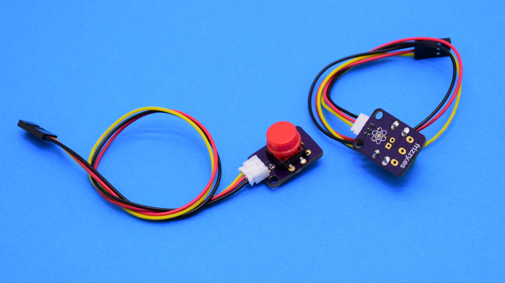

# Elemental Kit - Botón



El módulo de botón es un pequeño switch momentaneo de 12mm. Contiene el propio switch de dos posiciones "on/off" y su correspondiente resistencia pull-up. Cuando el botón es presionado, devuelve LOW y cuando lo sueltas devuelve HIGH. El conector de salida es el correspondiente JST-PH de 2.0mm compatible con los cables para la Grape.

## Características

* Botón fácil de usar
* Utiliza la clásica conexión "GND/VCC/SIG"
* Incluye la resistencia pull-up

##Primeros pasos
--------

###Grape


| Grape | Elemental - Boton |
| ----- | ----------------- |
| GND   | Negro             |
| 5V    | Rojo              |
| D2    | Amarillo          |


```arduino
const int pinBoton = 2;     // Pin del botón
const int ledPin =  13;     // Pin del Led

int estadoBoton = 0;        // variable para leer el estado del botón

void setup() {
    // inicializamos el led como salida
    pinMode(ledPin, OUTPUT);
    // inicializamos el boton como entrada
    pinMode(pinBoton, INPUT);
}

void loop(){
    // leemos el estado del boton y lo almacenamos en nuestra variable
    estadoBoton = digitalRead(pinBoton);

    // comprueba si se ha pulsado el boton
    // si se ha pulsado el estado es LOW
    if (estadoBoton == LOW) {
        // encendemos el led
        digitalWrite(ledPin, HIGH);
    }
    else {
        //apagamos el led
        digitalWrite(ledPin, LOW);
    }
}
```


##Recursos
-------

-   [Archivos PCB en KiCAD](https://github.com/FrizzyElectronics/BasicModule-II)
-   [Esquema en PDF](https://raw.githubusercontent.com/FrizzyElectronics/BasicModule-II/master/pdf/BasicModule-II.pdf "File:BasicModule-II.pdf")
-   [Fritzing](https://raw.githubusercontent.com/FrizzyElectronics/AtomModulesFritzingParts/master/FritzingParts/Atom_Button.fzpz "File:BasicModule-II.pdf")

## Licencia
-------
Copyright (c) 2018-2017 Frizzy Electronics. (https://www.frizzy.es). Todo el texto y las fotografías bajo licencia <a rel="license" href="http://creativecommons.org/licenses/by-sa/4.0/">Creative Commons Attribution-ShareAlike 4.0 International License</a>. <a rel="license" href="http://creativecommons.org/licenses/by-sa/4.0/"> </a>

## Soporte Técnico
-------
Por favor, comunicanos cualquier incidencia para poder mejorar juntos. Escribenos a [info@frizzy.es](info@frizzy.es). 

