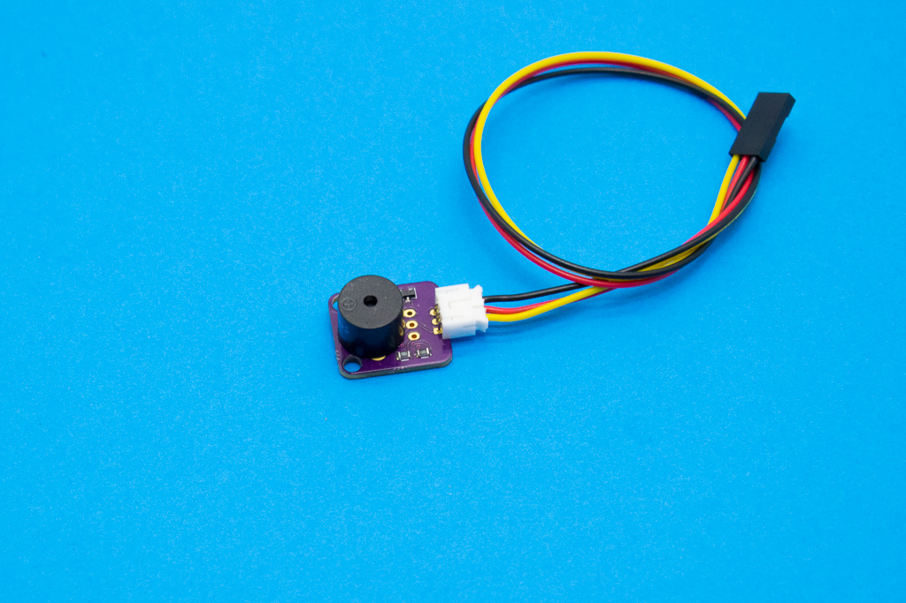

# Elemental Kit - Buzzer



El módulo buzzer consta de un zumbador pasivo con el que puedes reproducir tonos. El conector de salida es el correspondiente JST-PH de 2.0mm compatible con los cables para la Grape.

## Características

* Buzzer pasivo
* Utiliza la clásica conexión "GND/VCC/SIG"
* Incluye transistor de control

##Primeros pasos
--------

###Grape


| Grape | Elemental - Buzzer|
| ----- | ----------------- |
| GND   | Negro             |
| 5V    | Rojo              |
| D9    | Amarillo          |


```arduino

const int buzzerPin =  9;     // Pin del zumbador

void setup() {

    pinMode(buzzerPin, OUTPUT); //Declaramos el pin del buzzer como salida

}

void loop(){
    
    tone(buzzerPin,1000,100); //Reproducimos un tono de 1000Hz de 100ms
    tone(buzzerPin,2000,1000); //Reproducimos un tono de 2000Hz de 1000ms
}
```


##Recursos
-------

-   [Archivos PCB en KiCAD](https://github.com/FrizzyElectronics/BasicModule)
-   [Esquema en PDF](https://raw.githubusercontent.com/FrizzyElectronics/BasicModule/master/pdf/BasicModule.pdf "File:BasicModule.pdf")
-   [Fritzing](https://raw.githubusercontent.com/FrizzyElectronics/AtomModulesFritzingParts/master/FritzingParts/Atom_Buzzer.fzpz "File:Atom_Buzzer.fzpz")

## Licencia
-------
Copyright (c) 2018-2017 Frizzy Electronics. (https://www.frizzy.es). Todo el texto y las fotografías bajo licencia <a rel="license" href="http://creativecommons.org/licenses/by-sa/4.0/">Creative Commons Attribution-ShareAlike 4.0 International License</a>. <a rel="license" href="http://creativecommons.org/licenses/by-sa/4.0/"> </a>

## Soporte Técnico
-------
Por favor, comunicanos cualquier incidencia para poder mejorar juntos. Escribenos a [info@frizzy.es](info@frizzy.es). 

