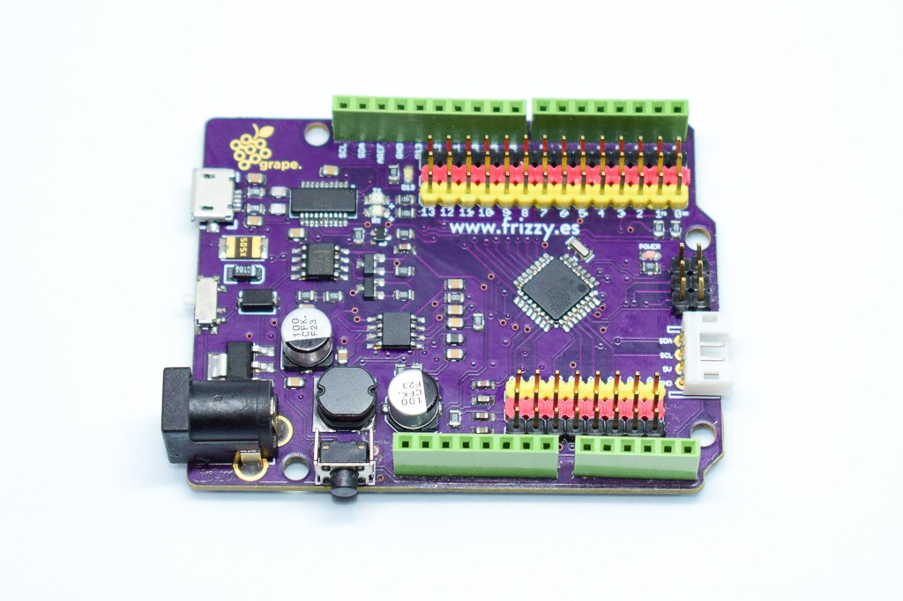

# Elemental Kit - Grape

[](www.frizzy.es/grape)

La Frizzy Electronics **Grape** es una placa de desarrollo basada en el microcontrolador ATMEGA329P-AU de 8bits de la familia AVR. La placa Grape posee 14 pines digitales configurables como entrada o salida de los cuales 6 pueden ser usados como salidas PWM y 8 entradas analogicas. Como principal caracteristica de la Grape nos encontramos con que posee pines de conexión rapida los cuales ya incorporan alimentación y señal, evitando así el uso de las molestas protoboard. Tienes todo un ecosistema de módulos [Atom](https://frizzy.es/elemental-kit/) que puedes conectar. La placa es totalmente compatible con el Arduino UNO tanto en el uso de shields como en la posicion de los agujeros de montaje.


## Características

| Característica |     Valor                |
| ----- | -----------------              |
| Microcontrolador   | Atmega328P-AU     |
| Memoria Flash      | 32KB              |
| Memoria SRAM       | 1KB               |
| Digital I/O        | 14                |
| Entradas Analogicas| 8                 |
| Salidas PWM        | 6                 |
| Tensión de alimentacion |7-23 V DC     |
| Corriente máxima |800 mA (3.3A) 2A (5V)|
| Conversor USB-UART |     FT231XS       |


##Primeros pasos
--------

###Grape

El GP2Y0A21YK0F es un sensor de distancia de tipo infrarrojo. Esta compuesto por un led IR y un dispositivo detector de posición (PSD). El emisor infrarrojo emite un haz de luz pulsante. El haz rebota en el objeto y vuelve para ser captado por el PSD el cual mide la distancia por triangulación.


El sensor devuelve un valor de tensión no lineal representado por esta gráfica, es por ello que tendremos que interpolar. Hemos optado por el uso de una librería que te facilita la tarea, ya que el uso de un código más complejo excedería la dificultad que buscamos con el Elemental Kit.

Si quieres aprender a usar el sensor de esta manera y no quieres usar la librería hay multitud de tutoriales como [este](http://www.naylampmechatronics.com/blog/55_tutorial-sensor-de-distancia-sharp.html) en internet. 

La librería que vamos a usar es de [Giuseppe Masino](https://github.com/qub1750ul/Arduino_SharpIR) y la podeis encontrar en el gestor de librerías oficial de Arduino dentro del menú Programa > Incluir Librería > Gestor de librerias bajo el nombre de "SharpIR"

###Conexión


| Grape | Elemental - Sensor de distancia |
| ----- | ----------------- |
| GND   | Negro             |
| 5V    | Rojo              |
| A2    | Amarillo          |


```arduino

#include <SharpIR.h>  //Incluimos la libreria


//Creamos una nueva instancia y la llamamos sensor
SharpIR sensor(GP2Y0A21YK0F, A2);   //Introducimos el pin y el modelo del sensor


void setup()
{
  Serial.begin(9600);  //Iniciamos el puerto serie a 9600 baudios
}

void loop()
{
  int distance = sensor.getDistance(); //Declaramos una variable para almacenar la distancia
  
  Serial.println(distance); //Imprimimos la distacia por el puerto serie.
}
```


##Recursos
-------

-   [Datasheet Atmega](http://ww1.microchip.com/downloads/en/DeviceDoc/Atmel-42735-8-bit-AVR-Microcontroller-ATmega328-328P_Datasheet.pdf "File: Datasheet.pdf")
-   [Fritzing](https://raw.githubusercontent.com/FrizzyElectronics/AtomModulesFritzingParts/master/FritzingParts/Grape.fzpz "File:Grape.fzpz")
-   [Archivos](https://github.com/FrizzyElectronics/Grape)
-   [Esquema en PDF](https://raw.githubusercontent.com/FrizzyElectronics/Grape/master/Hardware/KiCAD/pdf/Grape.pdf "File:Grape.pdf")

## Licencia
-------
Copyright (c) 2018-2017 Frizzy Electronics. (https://www.frizzy.es). Todo el texto y las fotografías bajo licencia <a rel="license" href="http://creativecommons.org/licenses/by-sa/4.0/">Creative Commons Attribution-ShareAlike 4.0 International License</a>. <a rel="license" href="http://creativecommons.org/licenses/by-sa/4.0/"> </a>

## Soporte Técnico
-------
Por favor, comunicanos cualquier incidencia para poder mejorar juntos. Escribenos a [info@frizzy.es](info@frizzy.es). 
