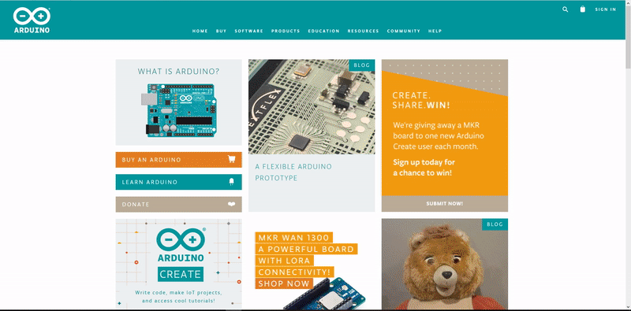
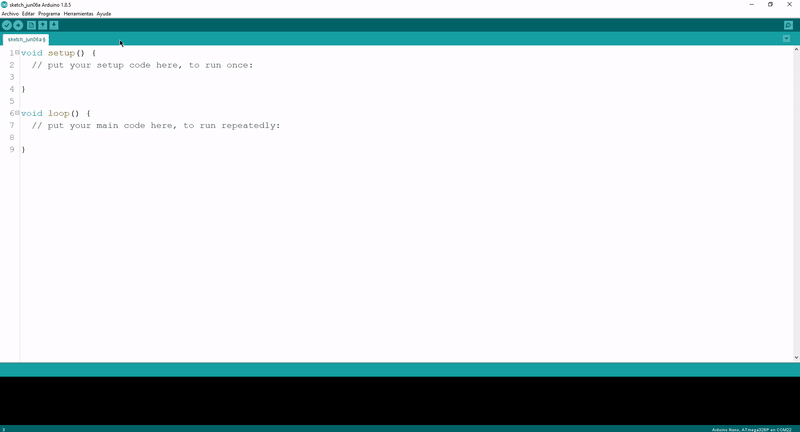
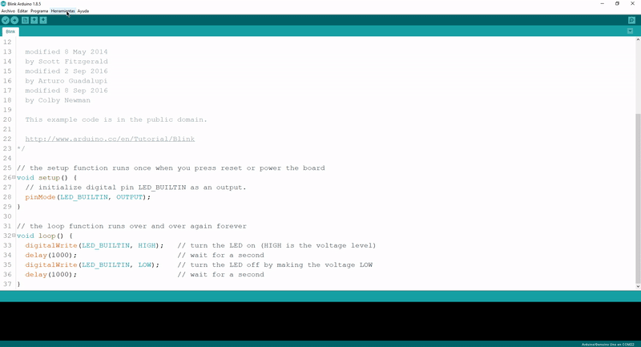
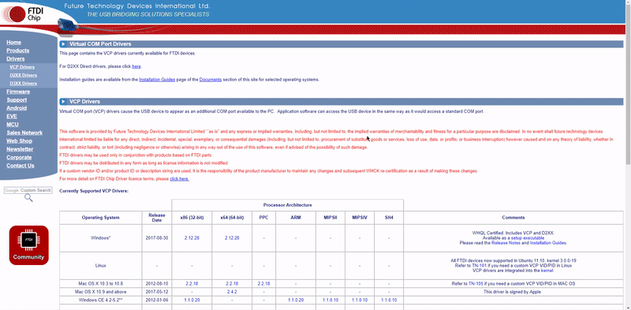

# Elemental Kit - Grape

[](www.frizzy.es/grape)

La Frizzy Electronics **Grape** es una placa de desarrollo basada en el microcontrolador ATMEGA329P-AU de 8bits de la familia AVR. La placa Grape posee 14 pines digitales configurables como entrada o salida de los cuales 6 pueden ser usados como salidas PWM y 8 entradas analogicas. Como principal caracteristica de la Grape nos encontramos con que posee pines de conexión rapida los cuales ya incorporan alimentación y señal, evitando así el uso de las molestas protoboard. Tienes todo un ecosistema de módulos [Atom](https://frizzy.es/elemental-kit/) que puedes conectar. La placa es totalmente compatible con el Arduino UNO tanto en el uso de sus shields como en la posición de los agujeros de montaje.

Incorporta un conector JST de 4 pines para conectar dispositivos I2C del ecosistema Atom como una pantalla Oled o una matriz led. Es capaz de soportar de continuo 2A de corriente por lo que no tendras ningún problema a la hora de hacer robots que usen varios servos, por ejemplo.


## Características

| Característica |     Valor             |
| ----- | -----------------              |
| Microcontrolador   | Atmega328P-AU     |
| Memoria Flash      | 32KB              |
| Memoria SRAM       | 1KB               |
| Digital I/O        | 14                |
| Entradas Analogicas| 8                 |
| Salidas PWM        | 6                 |
| Tensión de alimentacion |7-23 V DC     |
| Corriente máxima |800 mA (3.3A) 2A (5V)|
| Conversor USB-UART |     FT231XS       |


##Primeros pasos
--------

Para comenzar a usar nuestra placa Grape, lo primero que necesitaremos será descargar el IDE de Arduino. Para descargarlo, iremos a la web oficial de Arduino [www.arduino.cc](www.arduino.cc) y en la pestaña Software>Dowloads nos descargaremos el IDE para nuestra versión de sistema operativo. El IDE es totalmente gratuito, pero desde aquí hacemos un llamamiendo a las donaciones para contribuir con el proyecto Arduino. Si alguno está interesado en donar al descargarlo, puede hacerlo seleccionando la cantidad a donar. 

[](www.frizzy.es/grape)

También puedes comprar alguna de sus [placas](https://store.arduino.cc/) para apoyarles.

Una vez instalado en tu ordenador, abriremos la aplicación. Vamos a crear el primer programa conocido como "hola mundo". En el mundo de Arduino esto se conoce como Blynk, ya que la forma que tendrá la placa de decirnos "hola" será haciendo parpadear un led. Podemos escribir nosotros mismos el codigo o podemos abrir un ejemplo ya escrito como te enseñamos a continuación.

[](www.frizzy.es/grape)

En este código, lo que haremos será hacer parpadear el led conectado al pin 13, por lo que no necesitamos ningún módulo Atom externo ni hardware adicional, viene ya con nuestra placa Grape, por lo que siempre que nuestro pin digital 13 esté en modo HIGH, veremos encendido este led. Este led le podemos encontrar cerca del pin 13 con la serigrafía "D13" y cuando lo encendamos se iluminará de color azul. 

Es ahora cuando conectaremos nuestra Grape al ordenador mediante el cable micro-USB. Para subir el programa a la placa, debemos selecionar el modelo Arduino Nano en Herramientas > Placa > Arduino Nano, y el puerto COM en el que se encuentra nuestra placa mediante Herramientas > Puerto. 

[](www.frizzy.es/grape)

Si quieres copiar el código aquí lo tienes:

```arduino

const int ledPin =  13;     // Pin del Led

void setup() {
    // Inicializamos el led como salida
    pinMode(ledPin, OUTPUT);
}

void loop(){

    digitalWrite(ledPin, HIGH); //Encendemos el led
    delay(1000); //Esperamos 1 segundo
    digitalWrite(ledPin, LOW);  //Apagamos el led
    delay(1000); //Esperamos 1 segundo
}
```

Y si todo ha ido bien...¡deberías tener el led parpadeando!

##Drivers

Nuestra placa Grape incorpora el conversor USB-UART [FT231XS](http://www.ftdichip.com/Support/Documents/DataSheets/ICs/DS_FT231X.pdf) el cual es reconocido por la mayoría de sistemas operativos de manera nativa, por lo que no deberías tener ningún problema a la hora de que tu placa sea detectada por tu ordenador sin nedesidad de drivers, uses el sistema operativo que uses (Windows, Mac OS X o LinuX)

Si por algún motivo tienes problemas y tu ordenador no detecta tu placa, te enseñamos a instalar los drivers.

Debes descargarte los drivers de la [web del fabricante](http://www.ftdichip.com/Drivers/VCP.htm). Una vez ahí descargate la versión que corresponda para tu sistema operativo e instalalos en tu máquina. 

[](www.frizzy.es/grape)


##Recursos
-------

-   [Datasheet Atmega](http://ww1.microchip.com/downloads/en/DeviceDoc/Atmel-42735-8-bit-AVR-Microcontroller-ATmega328-328P_Datasheet.pdf "File: Datasheet.pdf")
-   [Fritzing](https://raw.githubusercontent.com/FrizzyElectronics/AtomModulesFritzingParts/master/FritzingParts/Grape.fzpz "File:Grape.fzpz")
-   [Archivos](https://github.com/FrizzyElectronics/Grape)
-   [Esquema en PDF](https://raw.githubusercontent.com/FrizzyElectronics/Grape/master/Hardware/KiCAD/pdf/Grape.pdf "File:Grape.pdf")
-   [Drivers USB](http://www.ftdichip.com/Drivers/VCP.htm)

## Licencia
-------
Copyright (c) 2018-2017 Frizzy Electronics. (https://www.frizzy.es). Todo el texto y las fotografías bajo licencia <a rel="license" href="http://creativecommons.org/licenses/by-sa/4.0/">Creative Commons Attribution-ShareAlike 4.0 International License</a>. <a rel="license" href="http://creativecommons.org/licenses/by-sa/4.0/"> </a>

## Soporte Técnico
-------
Por favor, comunicanos cualquier incidencia para poder mejorar juntos. Escribenos a [info@frizzy.es](info@frizzy.es). 
