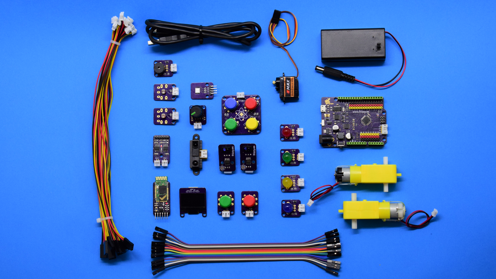

# Frizzy Electronics Wiki

## Frizzy Elemental Kit

## Plataformas

| **Arduino**  |    **Raspberry**  |    **Beaglebone**   | 
|:---:|:---:|:---:|
|   |   |  |

## Grape

| **Sensores**  |    **Actuadores**  |    **Displays**   | 
|:---:|:---:|:---:|
| |  |    |

| **Comunicacion**  |   **Otros**    |       |  
|:---:|:---:|:---:|
|    |    |   |

## Licencia
-------
Copyright (c) 2018-2017 Frizzy Electronics. (https://www.frizzy.es). Todo el texto y las fotografías bajo licencia <a rel="license" href="http://creativecommons.org/licenses/by-sa/4.0/">Creative Commons Attribution-ShareAlike 4.0 International License</a>. 

## Soporte Técnico
-------
Por favor, comunicanos cualquier incidencia para poder mejorar juntos. Escribenos a [info@frizzy.es](info@frizzy.es). 

