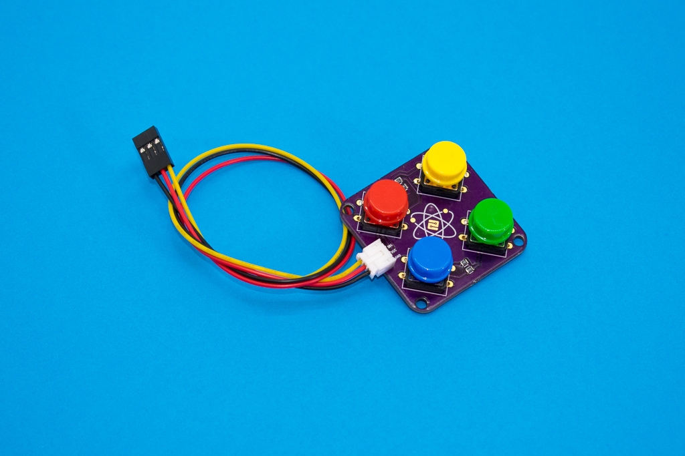

# Elemental Kit - Módulo Keypad



El módulo keypad contiene cuatro interruptores de 12mm conectados a cutro resistencias con diferentes valores para que puedas operar los 4 botones ¡con solo un pin analogico de tu placa! El conector de salida es el correspondiente JST-PH de 2.0mm compatible con los cables para la Grape.


## Características

* 4 botones de diferentes colores
* Utiliza la clásica conexión "GND/VCC/SIG"
* Incluye una resistencia diferente para cada botón

##Primeros pasos
--------

###Grape


| Grape | Elemental - keypad|
| ----- | ----------------- |
| GND   | Negro             |
| 5V    | Rojo              |
| A2    | Amarillo          |


```arduino

void setup() {

    Serial.begin(9600); //Iniciamos el puerto serie a 9600 baudios
}

void loop(){
    
    // leemos el estado de nuestra botonera y lo almacenamos en la variable
    botonera = analogRead(A2);

    Serial.println(botonera);
}
```


##Recursos
-------

-   [Archivos PCB en KiCAD](https://github.com/FrizzyElectronics/KeyPad)
-   [Esquema en PDF](https://raw.githubusercontent.com/FrizzyElectronics/KeyPad/master/pdf/KeyPad.pdf "File:Kaypad.pdf")
-   [Fritzing](https://raw.githubusercontent.com/FrizzyElectronics/AtomModulesFritzingParts/master/FritzingParts/Atom_Keypad.fzpz "File:KeyPad.pdf")

## Licencia
-------
Copyright (c) 2018-2017 Frizzy Electronics. (https://www.frizzy.es). Todo el texto y las fotografías bajo licencia <a rel="license" href="http://creativecommons.org/licenses/by-sa/4.0/">Creative Commons Attribution-ShareAlike 4.0 International License</a>. <a rel="license" href="http://creativecommons.org/licenses/by-sa/4.0/"> </a>

## Soporte Técnico
-------
Por favor, comunicanos cualquier incidencia para poder mejorar juntos. Escribenos a [info@frizzy.es](info@frizzy.es). 

