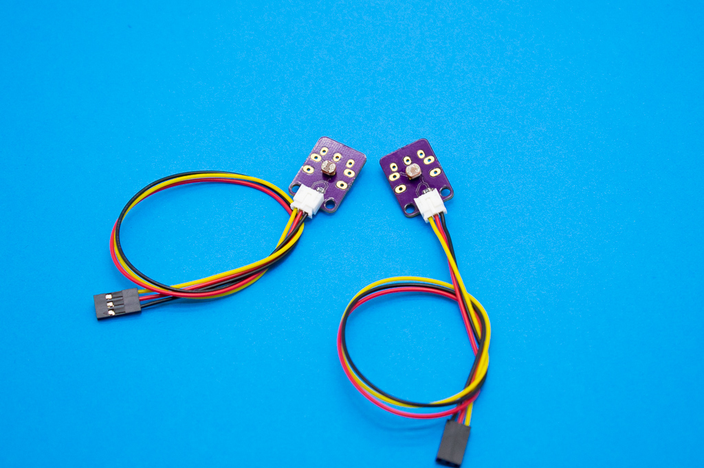

# Elemental Kit - LDR

[](www.frizzy.es/grape)

El módulo de ldr consta de un pequeño fotorresistor de 10k engarcado de captar el nivel de luz ambiente y devolvertelo en funcion de la tensión. El conector de salida es el correspondiente JST-PH de 2.0mm compatible con los cables para la Grape.

## Características

* Módulo fácil de usar
* Utiliza la clásica conexión "GND/VCC/SIG"
* Incluye el divisor resistivo

##Primeros pasos
--------

###Grape


| Grape | Elemental - LDR |
| ----- | ----------------- |
| GND   | Negro             |
| 5V    | Rojo              |
| A2    | Amarillo          |


```arduino

void setup() {
    //Inicializamos el puerto serie 9600 baudios
    Serial.begin(9600);
}

void loop(){
    // Leemos el sensor y lo asignamos a la variable luz
    luz = analogRead(A2);
    Serial.print("El nivel de luz es de:");
    Serial.println(luz);

}
```


##Recursos
-------

-   [Archivos PCB en KiCAD](https://github.com/FrizzyElectronics/BasicModule-II)
-   [Esquema en PDF](https://raw.githubusercontent.com/FrizzyElectronics/BasicModule-II/master/pdf/BasicModule-II.pdf "File:BasicModule-II.pdf")
-   [Fritzing](https://raw.githubusercontent.com/FrizzyElectronics/AtomModulesFritzingParts/master/FritzingParts/Atom_LDR.fzpz "File:BasicModule-II.pdf")

## Licencia
-------
Copyright (c) 2018-2017 Frizzy Electronics. (https://www.frizzy.es). Todo el texto y las fotografías bajo licencia <a rel="license" href="http://creativecommons.org/licenses/by-sa/4.0/">Creative Commons Attribution-ShareAlike 4.0 International License</a>. <a rel="license" href="http://creativecommons.org/licenses/by-sa/4.0/"> </a>

## Soporte Técnico
-------
Por favor, comunicanos cualquier incidencia para poder mejorar juntos. Escribenos a [info@frizzy.es](info@frizzy.es). 
