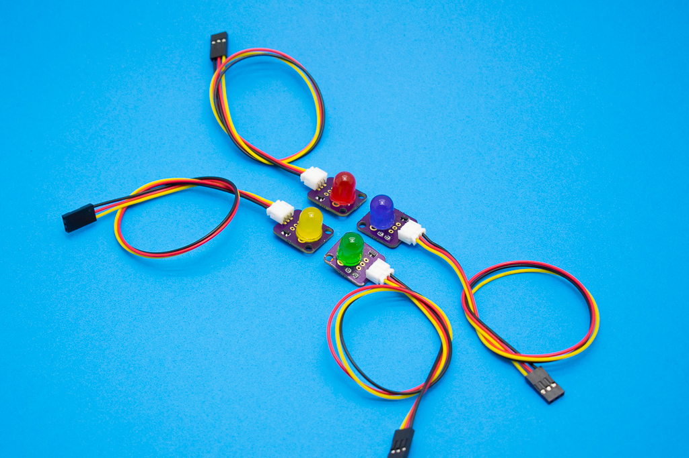

# Elemental Kit - Módulo LED



El módulo contiene un LED de 10mm muy util para tus primeros proyectos de electrónica o como indicador en tus proyectos más avanzados. Hemos añadido un pequeño transistor para reducir el consumo, de esta manera el LED es alimentado directamente por los 5V de alimentación y no por el pin del microcontrolador como en la mayoría de los montajes que puedes encontrar en Internet. El conector de salida es el correspondiente JST-PH de 2.0mm compatible con los cables para la Grape.

## Características

* Led de gran tamaño
* Utiliza la clásica conexión "GND/VCC/SIG"
* Incluye la resistencia limitadora

##Primeros pasos
--------

###Grape


| Grape | Elemental - Boton |
| ----- | ----------------- |
| GND   | Negro             |
| 5V    | Rojo              |
| D2    | Amarillo          |


```arduino

const int ledPin =  2;     // Pin del Led

void setup() {
    // Inicializamos el led como salida
    pinMode(ledPin, OUTPUT);
}

void loop(){

    digitalWrite(ledPin, HIGH); //Encendemos el led
    delay(1000); //Esperamos 1 segundo
    digitalWrite(ledPin, LOW);  //Apagamos el led
    delay(1000); //Esperamos 1 segundo
}
```


##Recursos
-------

-   [Archivos PCB en KiCAD](https://github.com/FrizzyElectronics/BasicModule)
-   [Esquema en PDF](https://raw.githubusercontent.com/FrizzyElectronics/BasicModule-II/master/pdf/BasicModule.pdf "File:BasicModule.pdf")
-   [Fritzing Rojo](https://raw.githubusercontent.com/FrizzyElectronics/AtomModulesFritzingParts/master/FritzingParts/Atom_Led_Red.fzpz "File:Atom_Led_Red.fzpz")
-   [Fritzing Verde](https://raw.githubusercontent.com/FrizzyElectronics/AtomModulesFritzingParts/master/FritzingParts/Atom_Led_Green.fzpz "File:Atom_Led_Green.fzpz")
-   [Fritzing Azul](https://raw.githubusercontent.com/FrizzyElectronics/AtomModulesFritzingParts/master/FritzingParts/Atom_Led_Blue.fzpz "File:Atom_Led_Blue.fzpz")
-   [Fritzing Amarillo](https://raw.githubusercontent.com/FrizzyElectronics/AtomModulesFritzingParts/master/FritzingParts/Atom_Led_Yellow.fzpz "File:Atom_Led_Yellow.fzpz")

## Licencia
-------
Copyright (c) 2018-2017 Frizzy Electronics. (https://www.frizzy.es). Todo el texto y las fotografías bajo licencia <a rel="license" href="http://creativecommons.org/licenses/by-sa/4.0/">Creative Commons Attribution-ShareAlike 4.0 International License</a>. <a rel="license" href="http://creativecommons.org/licenses/by-sa/4.0/"> </a>

## Soporte Técnico
-------
Por favor, comunicanos cualquier incidencia para poder mejorar juntos. Escribenos a [info@frizzy.es](info@frizzy.es). 

