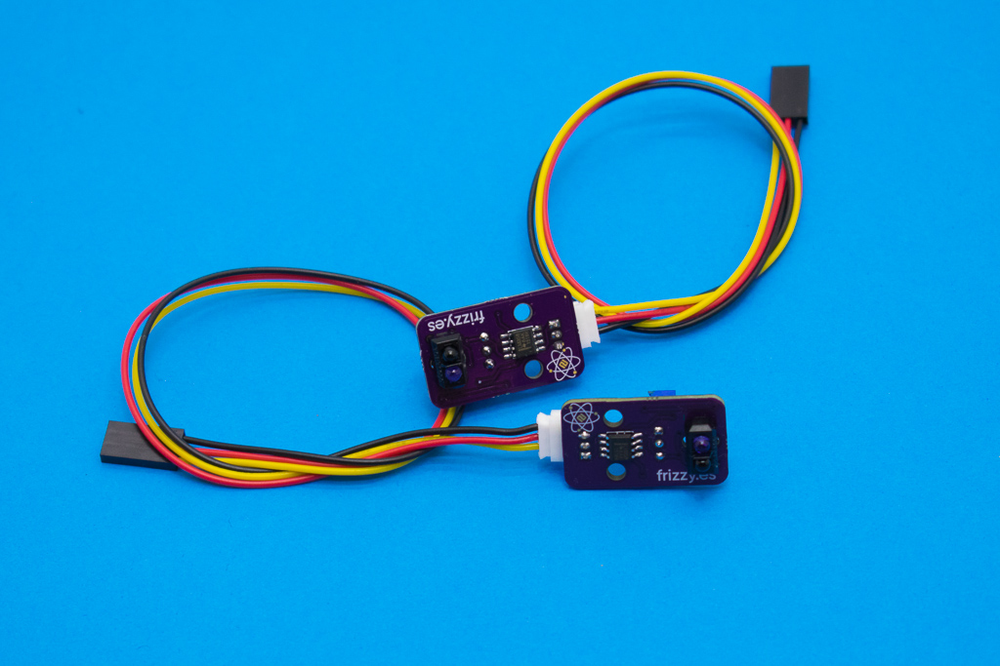

# Elemental Kit - Módulo Infrarrojo



El módulo de infrarrojos consta de un pequeño fotosensor TCRT5000 que incorpora un emisor de infrarrojos y un fototransistor engarcado de captar el haz infrarrojo si rebota en un objeto. Este modulo es realmente útil para proyectos como un robot sigue-lineas o una alarma para la puerta. El conector de salida es el correspondiente JST-PH de 2.0mm compatible con los cables para la [Grape](https://www.frizzy.es/grape/).

## Características

* Sensor PCRT5000
* Utiliza la clásica conexión "GND/VCC/SIG"
* Salida digital
* Incluye potenciómetro de ajuste de sensibilidad

##Primeros pasos
--------

###Grape


| Grape | Elemental - Infrared|
| ----- | ----------------- |
| GND   | Negro             |
| 5V    | Rojo              |
| D2    | Amarillo          |


```arduino

void setup() {
    //Inicializamos el puerto serie 9600 baudios
    Serial.begin(9600);
    //Iniciamos el pin del sensor como entrada
    pinMode(2, INPUT);
}

void loop(){
    // Leemos el sensor y lo asignamos a la variable sensor
    sensor = digitalRead(2);
    Serial.print("El estado del sensor es:");
    if(sensor == HIGH){
    	Serial.println("Activado!");
    }
    else{
    	Serial.println("Desactivado...");
    }

}
```


##Recursos
-------

-   [Datasheet fotosensor](https://www.vishay.com/docs/83760/tcrt5000.pdf "File: Datasheet.pdf")
-   [Archivos PCB en KiCAD](https://github.com/FrizzyElectronics/Line-follower-sensor)
-   [Esquema en PDF](https://raw.githubusercontent.com/FrizzyElectronics/Line-follower-sensor/master/pdf/Modulo_IR.pdf "File:Modulo_IR.pdf")
-   [Fritzing](https://raw.githubusercontent.com/FrizzyElectronics/AtomModulesFritzingParts/master/FritzingParts/Atom_Infrared.fzpz "File:Atom_Infrared.fzpz")

## Licencia
-------
Copyright (c) 2018-2017 Frizzy Electronics. (https://www.frizzy.es). Todo el texto y las fotografías bajo licencia <a rel="license" href="http://creativecommons.org/licenses/by-sa/4.0/">Creative Commons Attribution-ShareAlike 4.0 International License</a>. <a rel="license" href="http://creativecommons.org/licenses/by-sa/4.0/"> </a>

## Soporte Técnico
-------
Por favor, comunicanos cualquier incidencia para poder mejorar juntos. Escribenos a [info@frizzy.es](info@frizzy.es). 
