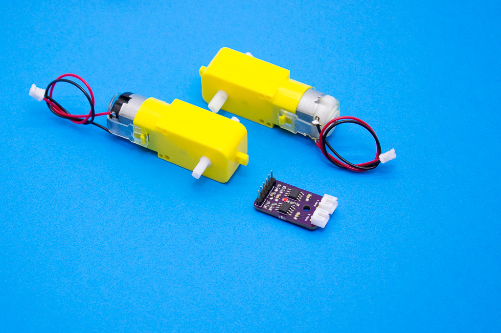

# Elemental Kit - Motor Controller



El módulo Motor Controller es una pequeña placa capaz de controlar 2 motores de corriente continua o un motor paso a paso gracias a sus dos drivers integrados L9110. Puedes controlar motores de corriente continua con un consumo continuado de 800mA con total tranquilidad y puede soportar picos de entre 1.5A y 2A aunque no recomendamos nunca llegar a esas cifras. Así mismo, el driver también incluye diodos de protección. 

El módulo cuenta con dos conectores para sus dos respectivos motores, dos pines de alimentación con los que puedes alimentar el modulo de manera independiente para no dañar tu arduino y 4 conectores de señal para manejar los motores con tu [Grape](https://www.frizzy.es/grape/).

## Características

* Fácil de contectar
* 800mA de corriente 
* Capaz de controlar dos motores
* Tensión de entrada de 2.5V a 12V

##Primeros pasos
--------

Para controlar los motores, podremos usar pines digitales con o sin PWM, la diferencia la tendremos en la capacidad de control de estos. Sin PWM, solo podremos encender o apagar el motor pero en ningun caso podremos controlar la velocidad de los motores. Dependiendo del proyecto en el que estés te convendrá usarlo de una manera o de otra, por ejemplo, para un robot siguelineas necesitaremos controlar la velocidad para que siga la linea con más suavidad, mientras que para encender un ventilador no tendriamos por que necesitar controlar la velocidad, solo su encendido. 

El funcionamiento del controlador es el siguiente: 

| M1 - A|  M1 - B | Motor 1 |
| ----- | --------|-------- |
| LOW   | LOW     |     APAGADO      |
| HIGH  | LOW     |     ADELANTE     |
| LOW   | HIGH    |      ATRÁS       |
| HIGH  | HIGH    |     APAGADO      |

| M2 - A|  M2 - B | Motor 2 |
| ----- | --------|-------- |
| LOW   | LOW     |     APAGADO      |
| HIGH  | LOW     |     ADELANTE     |
| LOW   | HIGH    |      ATRÁS       |
| HIGH  | HIGH    |     APAGADO      |


###Grape

Ya que nuestra placa [Grape](https://www.frizzy.es/grape/) puede aguantar hasta 2A de corriente, puedes conectar sin problemas la alimentación del módulo directamente a los 5V de la placa.


En el caso de necesitar más velocidad o no disponer de una placa que aguante esta corriente, recomedamos que lo alimentes a parte compartiendo las tierras, tal y como describe siguiente diagrama:


| Grape | Elemental - Motor Gontroller|
| ----- | ----------------- |
| GND   | GND               |
| 5V    | VCC               |
| 11~   | M2 - A            |
| 10~   | M2 - B            |
| 5~    | M1 - B            |
| 6~    | M1 - A            |


```arduino
//Declaramos los pines de salida, deben ser pines PWM si queremos
//contorlar la velocidad de los motores

const int M1A = 6;
const int M1B = 5;
const int M2A = 11;
const int M2B = 10;

void setup() {
    //Establecemos los pines como salidas.
    pinMode(M1A, OUTPUT);
    pinMode(M1B, OUTPUT);
    pinMode(M2A, OUTPUT);
    pinMode(M2B, OUTPUT);
}

void loop(){
    
    //Giramos el motor 1 a maxima velocidad en un sentido
    analogWrite(M1A, 255);
    analogWrite(M1B, 0);
    delay(3000);
    //Giramos el motor 1 a maxima velocidad en el sentido contrario
    analogWrite(M1A, 0);
    analogWrite(M1B, 255);
    delay(3000);
    //Giramos el motor 2 a maxima velocidad en un sentido
    analogWrite(M2A, 255);
    analogWrite(M2B, 0);
    delay(3000);
    //Giramos el motor 2 a maxima velocidad en el sentido contrario
    analogWrite(M2A, 0);
    analogWrite(M2B, 255);
    delay(3000);

}
```

##Recursos
-------
-   [Datasheet](https://raw.githubusercontent.com/FrizzyElectronics/MotorController/blob/master/datasheet/l9110.pdf "File:l9110.pdf")
-   [Archivos PCB en KiCAD](https://github.com/FrizzyElectronics/MotorController)
-   [Esquema en PDF](https://raw.githubusercontent.com/FrizzyElectronics/MotorController/master/pdf/MotorController.pdf "File:MotorController.pdf")
-   [Fritzing](https://raw.githubusercontent.com/FrizzyElectronics/AtomModulesFritzingParts/master/FritzingParts/Atom_Motor_Controller.fzpz "File:MotorController.fzpf")

## Licencia
-------
Copyright (c) 2018-2017 Frizzy Electronics. (https://www.frizzy.es). Todo el texto y las fotografías bajo licencia <a rel="license" href="http://creativecommons.org/licenses/by-sa/4.0/">Creative Commons Attribution-ShareAlike 4.0 International License</a>. <a rel="license" href="http://creativecommons.org/licenses/by-sa/4.0/"> </a>

## Soporte Técnico
-------
Por favor, comunicanos cualquier incidencia para poder mejorar juntos. Escribenos a [info@frizzy.es](info@frizzy.es). 
