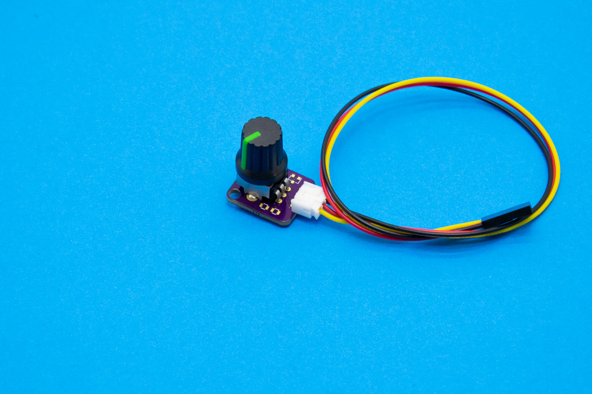

# Elemental Kit - Potenciómetro

[](www.frizzy.es/grape)

El módulo de ldr consta de un pequeño fotorresistor de 10k engarcado de captar el nivel de luz ambiente y devolvertelo en funcion de la tensión. El conector de salida es el correspondiente JST-PH de 2.0mm compatible con los cables para la Grape.

El módulo de potenciómetro consta de un potenciómetro de 10k conectado directamente al conector JST, es la manera más sencilla de añadir rápidamente un controlador de este tipo a tus proyectos. El conector de salida es el correspondiente JST-PH de 2.0mm compatible con los cables para la Grape.

## Características

* Módulo fácil de usar
* Utiliza la clásica conexión "GND/VCC/SIG"
* Incluye el divisor resistivo

##Primeros pasos
--------

###Grape


| Grape | Elemental - Potenciómetro |
| ----- | ----------------- |
| GND   | Negro             |
| 5V    | Rojo              |
| A2    | Amarillo          |


```arduino

void setup() {
    //Inicializamos el puerto serie 9600 baudios
    Serial.begin(9600);
}

void loop(){
    // Leemos el potenciómetro y lo asignamos a la variable potenciometro
    potenciometro = analogRead(A2);
    Serial.print("El nivel es de: ");
    Serial.println(potenciometro);

}
```


##Recursos
-------

-   [Archivos PCB en KiCAD](https://github.com/FrizzyElectronics/BasicModule)
-   [Esquema en PDF](https://raw.githubusercontent.com/FrizzyElectronics/BasicModule-II/master/pdf/BasicModule.pdf "File:BasicModule.pdf")
-   [Fritzing](https://raw.githubusercontent.com/FrizzyElectronics/AtomModulesFritzingParts/master/FritzingParts/Atom_Potentiometer.fzpz "File:BasicModule.pdf")

## Licencia
-------
Copyright (c) 2018-2017 Frizzy Electronics. (https://www.frizzy.es). Todo el texto y las fotografías bajo licencia <a rel="license" href="http://creativecommons.org/licenses/by-sa/4.0/">Creative Commons Attribution-ShareAlike 4.0 International License</a>. <a rel="license" href="http://creativecommons.org/licenses/by-sa/4.0/"> </a>

## Soporte Técnico
-------
Por favor, comunicanos cualquier incidencia para poder mejorar juntos. Escribenos a [info@frizzy.es](info@frizzy.es). 
