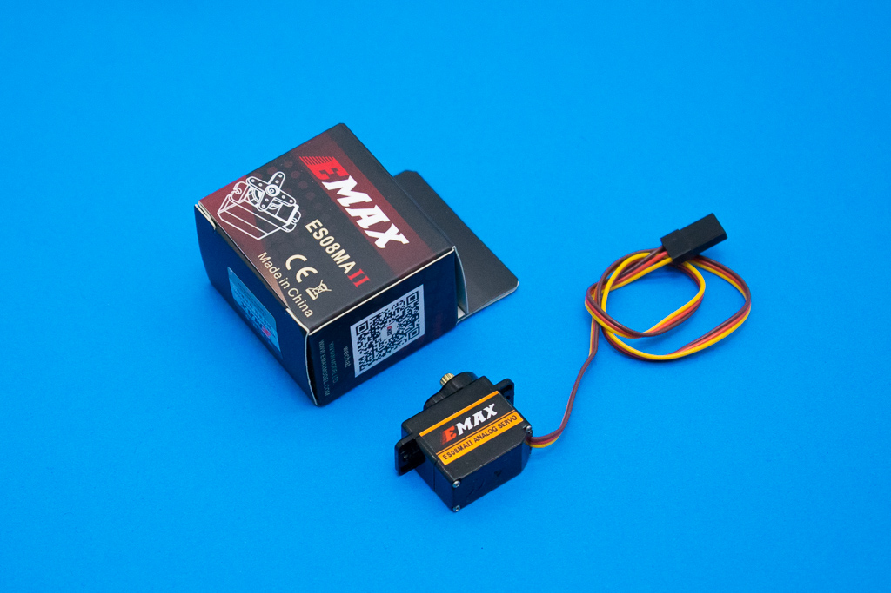

#Elemental Kit - Mini-Servo



El mini-servo ES08MA-II es tu perfecto aliado para tus primeros proyectos. Gracias a sus engranajes de metal, serás capaz de girar grandes cargas sin esfuerzo. Úsalo para hacer un barrido con un sensor o para abrir una puerta en una maqueta. ¡Las posibilidades son infinitas! El conector de salida es un FUT/JR de 2.54mm compatible con los pines de conexión rápida de la [Grape](https://www.frizzy.es/grape/).

## Características

* Recorrido: 180º
* Utiliza la clásica conexión "GND/VCC/SIG"
* Engranajes internos de metal
* Torque: 1.8Kg/CM a 6V

### Vista interior


##Primeros pasos
--------

###Grape


| Grape | Elemental - MiniServo |
| ----- | ----------------- |
| GND   | Marrón             |
| 5V    | Rojo              |
| D9    | Naranja          |


```arduino

#include <Servo.h>

Servo miniServo;  // Creamos un objeto servo para controlar el mini-servo

int posicion = 0;    // variable para guardar la posicion del servo

void setup() {
  miniServo.attach(9);  // adjuntamos el servo al pin 9
  Serial.begin(9600);   // Iniciamos el puerto serie para imprimir la posicion del servo (opcional)
}

void loop() {
  for (posicion = 0; posicion <= 180; posicion += 1) { // Recorremos de 0 a 180 con la variable posicion de grando en grado
    miniServo.write(posicion);              // aplicamos la posicion al servo
    Serial.println(posicion);			    // Imprimimos la posicion del servo (opcional)
    delay(15);                              // esperamos 15ms para que al servo le de tiempo a alcanzar la posicion
  }
  for (posicion = 180; posicion >= 0; posicion -= 1) { // Recorremos de 180 a 0 con la variable posicion de grando en grado
    miniServo.write(posicion);              // aplicamos la posicion al servo
    Serial.println(posicion);			    // Imprimimos la posicion del servo (opcional)
    delay(15);                              // esperamos 15ms para que al servo le de tiempo a alcanzar la posicion
  }
}
```


##Recursos
-------

-   [Web del fabricante](https://www.emaxmodel.com/es08ma-ii.html#product_tabs_description_tabbed)
-   [Datasheet](https://raw.githubusercontent.com/FrizzyElectronics/ElementalKitDocs/master/docs/images/servo2.jpg "File:Servo180.jpg")


## Licencia
-------
Copyright (c) 2018-2017 Frizzy Electronics. (https://www.frizzy.es). Todo el texto y las fotografías bajo licencia <a rel="license" href="http://creativecommons.org/licenses/by-sa/4.0/">Creative Commons Attribution-ShareAlike 4.0 International License</a>. <a rel="license" href="http://creativecommons.org/licenses/by-sa/4.0/"> </a>

## Soporte Técnico
-------
Por favor, comunicanos cualquier incidencia para poder mejorar juntos. Escribenos a [info@frizzy.es](info@frizzy.es). 
