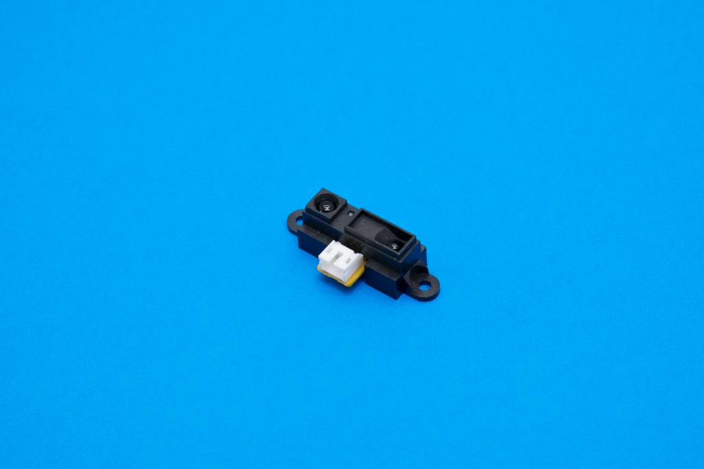

# Elemental Kit - Sensor de distancia infrarrojo




Los sensores de distancia Sharp son una buena opción para muchos proyectos que necesitan mediciones precisas de distancia. De toda la gama de sensores infrarrojos de distanca que Sharp fabrica, hemos optado por usar el GP2Y0A21YK0F debido a su sencillez de uso y a que posee un rango de medición (10-80cm) aplicable en la mayoria de proyectos de robótica amateur. 

La conexion de este sensor es bastante sencilla, siemplemente tienes que conectar la alimentación y la salida de señal a un pin con conversor analogico-digital de tu microcontrolador favorito. Para facilitar la tarea, hemos añadido un cable compatible con la placa [Grape](https://www.frizzy.es/grape/), pero cuidado, ¡Este cable tiene los pines de Vcc y GND invertidos! **¡No emplees este cable para conectar otros módulos Elemental!**


## Características

* Modelo: GP2Y0A21YK0F
* Tensión de funcionamiento: 4.5V - 5.5V
* Consumo: 30mA
* Rango de medición: 10cm - 80cm
* Tipo de salida: Analógica
* Tiempo de respuesta: 38 ± 10 ms
* Medidas: 29.5×13×13.5 mm
* Peso: 3.5g

##Primeros pasos
--------

###Grape

El GP2Y0A21YK0F es un sensor de distancia de tipo infrarrojo. Esta compuesto por un led IR y un dispositivo detector de posición (PSD). El emisor infrarrojo emite un haz de luz pulsante. El haz rebota en el objeto y vuelve para ser captado por el PSD el cual mide la distancia por triangulación.


El sensor devuelve un valor de tensión no lineal representado por esta gráfica, es por ello que tendremos que interpolar. Hemos optado por el uso de una librería que te facilita la tarea, ya que realizar ese cálculo matemático excedería la dificultad que buscamos con el Elemental Kit.

Si quieres aprender a usar el sensor interpolando y no quieres usar la librería hay multitud de tutoriales como [este](http://www.naylampmechatronics.com/blog/55_tutorial-sensor-de-distancia-sharp.html) en internet. 

La librería que vamos a usar es de [Giuseppe Masino](https://github.com/qub1750ul/Arduino_SharpIR) y la podeis encontrar en el gestor de librerías oficial de Arduino dentro del menú Programa > Incluir Librería > Gestor de librerias bajo el nombre de "SharpIR"

###Conexión


| Grape | Elemental - Sensor de distancia |
| ----- | ----------------- |
| GND   | Negro             |
| 5V    | Rojo              |
| A2    | Amarillo          |


```arduino

#include <SharpIR.h>  //Incluimos la libreria


//Creamos una nueva instancia y la llamamos sensor
SharpIR sensor(GP2Y0A21YK0F, A2);   //Introducimos el pin y el modelo del sensor


void setup()
{
  Serial.begin(9600);  //Iniciamos el puerto serie a 9600 baudios
}

void loop()
{
  int distance = sensor.getDistance(); //Declaramos una variable para almacenar la distancia
  
  Serial.println(distance); //Imprimimos la distacia por el puerto serie.
}
```


##Recursos
-------

-   [Datasheet](http://www.sharp-world.com/products/device/lineup/data/pdf/datasheet/gp2y0a21yk_e.pdf "File: SharpDatasheet")
-   [Librería](https://github.com/qub1750ul/Arduino_SharpIR)

## Licencia
-------
Copyright (c) 2018-2017 Frizzy Electronics. (https://www.frizzy.es). Todo el texto y las fotografías bajo licencia <a rel="license" href="http://creativecommons.org/licenses/by-sa/4.0/">Creative Commons Attribution-ShareAlike 4.0 International License</a>. <a rel="license" href="http://creativecommons.org/licenses/by-sa/4.0/"> </a>

## Soporte Técnico
-------
Por favor, comunicanos cualquier incidencia para poder mejorar juntos. Escribenos a [info@frizzy.es](info@frizzy.es). 
